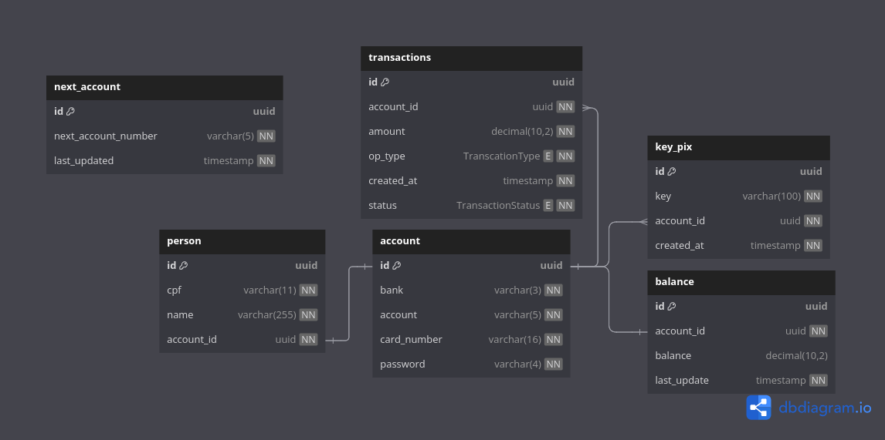

# VR Conta Digital
De forma a diversificar seus negócios, a VR entrou no ramo de bancos digitais. Seu aplicativo buscará possuir funcionalidades muito semelhantes às existentes em outros apps como Mercado Pago, PicPay e outros.

As funcionalidades a serem criadas neste primeiro momento são as abaixo:

* criação de contas corrente
* consulta de saldo
* depósito via pix
* saque

## Pontos considerados durante o desenvolvimento:
- **Considerados, mas não aplicados:**
  - É crucial que os dados sensíveis sejam criptografados, mas por se tratar de um teste, regras de criptografia não foram aplicadas.
  - Mantive apenas os históricos das transações de depósitos e saques bem sucessedidos. Mas é importante manter todas as tentativas de transações, para eventuais analíses e/ou auditorias.
  - Para garantir a consistência dos dados em chamadas concorrentes podemos utilizar algumas abordagems como:
    - Utilizar o redis para fazer um lock centralizado e mais performático em ambientes que possam ter mais uma instância da aplicação em execução.
    - Realizar um lock direto no banco dados.
    - Se o processamento não for síncrono, podemos utilizar uma fila de processamento.
- **Aplicados:**
  - A rotina de processamento da transação foi utilizado o patterns **factory method**, com base no tipo da transação ele executa a rotina de depósito ou saque.
  - A rotina de saque foi utilizado patterns **chain of responsibility**. Para saperar a cadeia de validação em várias etapas, facilitando a manutenção e implementação de novas validações.

## Dependências utilizadas
- Java: `openjdk-21`
- Spring Boot: `3.4.0`
- flyway
- mysql
- mysql-connector-j
- h2

## Cobertura de testes
Foi gerado um relatório com o JaCoCo para analisar a combertura do código. Estamos com uma cobertura de 97% em todo o código e de 100% na regra de negócio.

## Estrutura da base de dados


## Execução
- **Windows:**
  - Build
    - `mvn clean install -DskipTests=true`
  - Iniciar o banco de dados
    - `docker compose up db -d`
  - Executar o aplicativo .jar
    - `mvn spring-boot:run`

## Documentação API

- **Autenticação:**
  -  BASIC, com login = username e senha = password (use exatamente este usuário e esta senha)


- **Criar uma nova conta**
    - **Request**
      - Método: `POST`
      - URL: `http://localhost:8080/contascorrente`
      - body:
        ```json
        {
        "cpf": "65456765800",
        "nome": "José da Silva"
        }
        ```
    - **Response**
      - Status code: 201 Conta criada com sucesso
        ```json
        {
          "banco": "610", (valor fixo)
          "conta": "00023", (número da conta, sem dígito. Número sequencial, com 5 zeros à esquerda)
          "cartao": "5432768594565632", (numero do cartão, com 16 dígitos em formato String. Valor aleatório)
          "senha": "1234" (senha da conta e do cartão. Valor aleatório)
        }
        ```
      - Status code: 422 Já existe uma conta para o cpf informado
      - Status code: 400 Um dos campos vazio
      - Status code: 401 Erro de autenticação


- **Consulta de saldo conta**
    - **Request**
        - Método: `GET`
        - URL: `http://localhost:8080/contascorrente/{numeroconta}`
    - **Response**
        - Status code: 200 Consulta realizada com sucesso
          ```
          495.15
          ```
        - Status code: 404 Conta não encontrada.
        - Status code: 401 Erro de autenticação


- **Realizar um depósito na conta via pix**
    - **Request**
        - Método: `POST`
        - URL: `http://localhost:8080/contascorrente/{chave-pix}/deposito-pix`
        - body:
          ```json
          {
          "valor": 50.13,
          "senha": "1234"
          }
          ```
    - **Response**
        - Status code: 200 Depósito realizado com sucesso
        - Status code: 404 have pix não corresponde a uma conta
        - Status code: 400 Um dos campos vazio
        - Status code: 401 Erro de autenticação


- **Realizar um saque na conta**
    - **Request**
        - Método: `POST`
        - URL: `http://localhost:8080/contascorrente/{chave-pix}/saque`
        - body (JSON):
          ```json
          {
          "valor": 50.13,
          "senha": "1234"
          }
          ```
    - **Response**
        - Status code: 200 Saque realizado com sucesso
          ```json
          { "saldo": 495.15 }
          ```
        - Status code: 422 Chave pix não corresponde a uma conta
          ```
          CONTA_NAO_ENCONTRADA
          ```
        - Status code: 422 Saldo insuficiente
          ```
          SALDO_INSUFICIENTE
          ```
        - Status code: 400 Um dos campos vazio
        - Status code: 401 Erro de autenticação